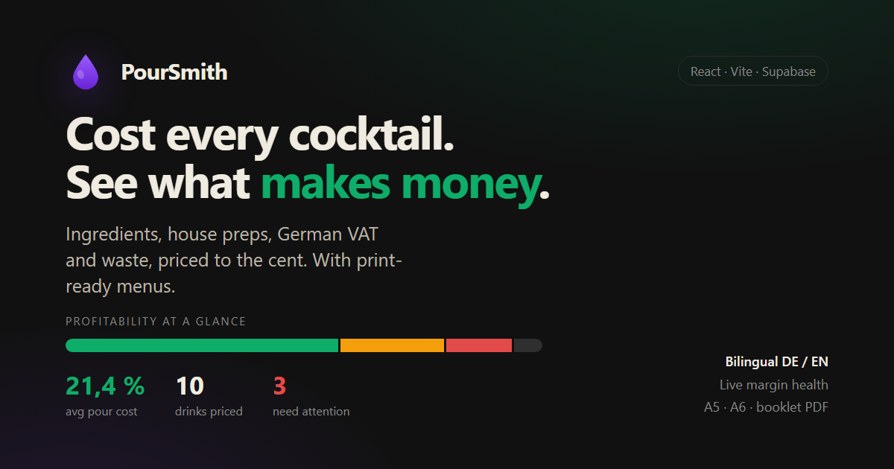

# PourSmith

[](https://github.com/OscarBougart/poursmith/actions/workflows/ci.yml)
[](https://github.com/OscarBougart/poursmith/actions/workflows/e2e.yml)

**A pour-cost and margin engine for bars.** Cost every cocktail to the cent — spirits, house-made preps, German VAT and waste included — and see at a glance which drinks make money and which bleed it.

🔗 **Live demo: [poursmith.vercel.app](https://poursmith.vercel.app)** — opens straight into a personal, editable sandbox seeded with a full bar. No sign-up.



## What it does

- **Ingredient library** — purchase price, pack size, VAT rate (19 % / 7 % / 0 %) and waste %, with net unit cost derived automatically.
- **House preps** — syrups, cordials, infusions and batches with their own yield. Preps can nest inside other preps; cost flows through recursively (with cycle protection).
- **Recipe costing** — build a drink from ingredients and preps and get its pour cost, cost %, net margin and a suggested price hitting your target, all live as you edit.
- **Profitability at a glance** — a red/amber/green health meter over the whole recipe book, so a menu's weak spots are visible before the detail table.
- **Menus** — group drinks into menus and export a print-ready guest card (names, descriptions, prices) or an internal sheet (costs and margins), plus CSV.
- **Bilingual DE / EN** — every user-facing string flows through an i18n lookup; German and English are first-class, with locale-aware EUR and percentage formatting.

## Tech stack

| Layer | Choice |
|-------|--------|
| Build | Vite 8 |
| UI | React 19 + TypeScript (strict, no `any`) |
| Styling | Tailwind CSS 4 with a tokenized palette (`dram-tokens.css`) |
| Backend | Supabase (Postgres + Row Level Security + anonymous auth) |
| Tests | Vitest (92 tests over the costing, pricing and parsing logic) |
| Hosting | Vercel |

## Architecture notes

**The costing core is pure and tested.** All money math lives in framework-free modules under `src/lib` (`cost.ts`, `recipeCost.ts`, `pricing.ts`, `menuAnalytics.ts`) and is covered by unit tests. VAT handling, waste inflation, recursive prep resolution and the RAG thresholds are one source of truth shared by the on-screen tables, the CSV export and the print views.

**Per-user isolation via RLS.** Every row is scoped to `auth.uid()`; Postgres Row Level Security policies enforce it at the database, not just the client.

**Zero-friction demo.** Visitors are signed in anonymously and get their own seeded copy of the library via an idempotent `seed_demo_data()` Postgres function — so the demo "just works" while every visitor stays isolated and can edit freely. See `supabase/seed-demo-function.sql`.

**Caching-friendly bundle.** React and `@supabase/supabase-js` are split into their own vendor chunks, so app-code edits only invalidate the small (~25 KB gzipped) application chunk on repeat visits.

## Local development

```bash
npm install
npm run dev        # start the dev server
npm test           # unit suite (Vitest) over the costing/pricing logic
npm run test:e2e   # end-to-end smoke of the demo flow (Playwright)
npm run build      # type-check + production build
npm run lint       # oxlint
```

Create a `.env` with your Supabase project:

```
VITE_SUPABASE_URL=your-project-url
VITE_SUPABASE_ANON_KEY=your-publishable-anon-key
```

Then run the SQL in `supabase/` in order: `schema.sql`, `schema-epic2.sql`, `schema-epic3.sql`, `schema-rpc.sql`, then `seed-demo-function.sql` to enable the per-visitor demo seeding.

## Project layout

```
src/
  components/   UI: tabs, forms, tables, print views, the profitability meter
  hooks/        useAuth, useLibrary, useSettings, usePersistentState, …
  lib/          pure costing/pricing/analytics logic (framework-free, tested)
  i18n/         DE/EN message catalogs + locale context
  data/         shared types
supabase/       schema, RLS policies, seed data, demo-seeding function
```
